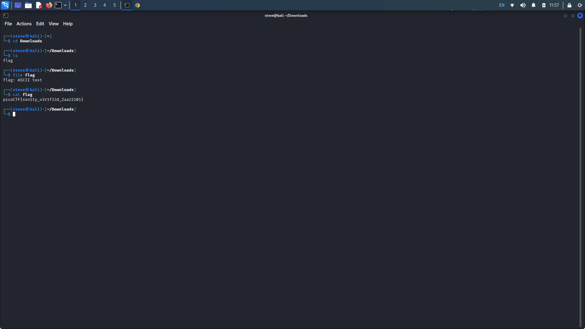
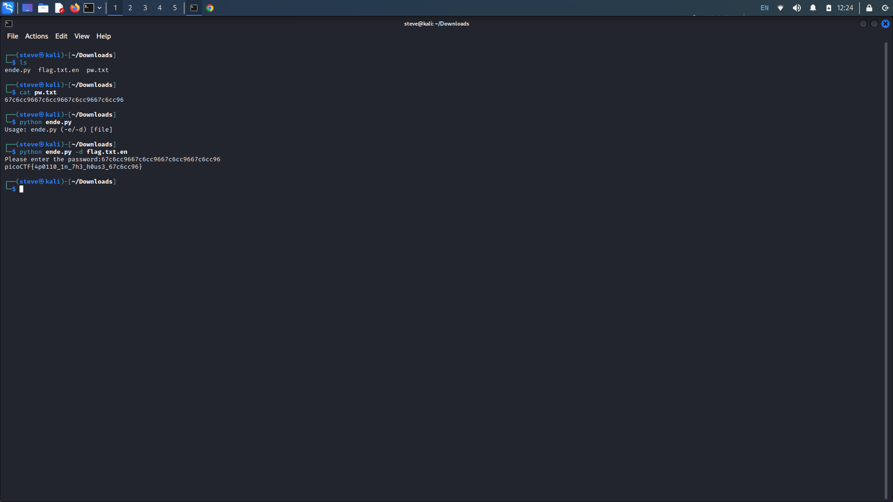
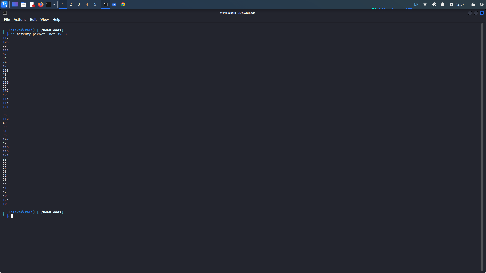
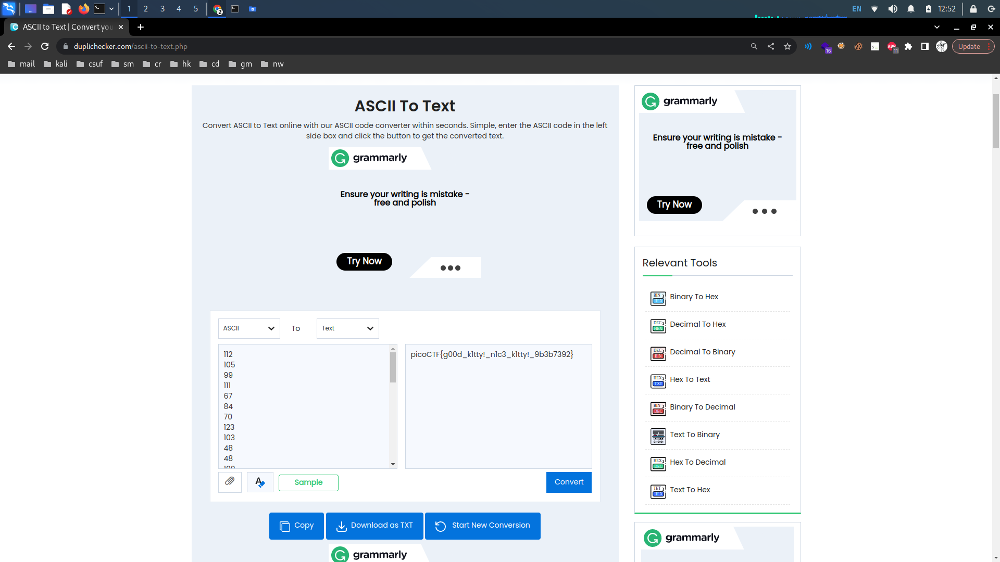
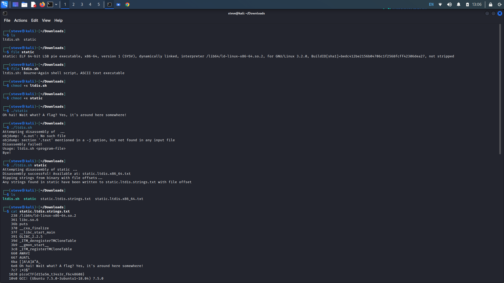

# PicoCTF General Skills: 1-5

## 1. Obedient Cat

Provided Hints:

Any hints about entering a command into the Terminal (such as the next one), will start with a '$'... everything after the dollar sign will be typed (or copy and pasted) into your Terminal.\
\
To get the file accessible in your shell, enter the following in the Terminal prompt: $ wget https://mercury.picoctf.net/static/33996e32dce022205a6a36f69aba56f0/flag

`$ man cat`

**Description:** This file has a flag in plain sight (aka "in-the-clear"). [Download flag](https://mercury.picoctf.net/static/33996e32dce022205a6a36f69aba56f0/flag).

Upon downloading the file, navigate to your /Downloads folder. List the files in the folder with the _ls_ command. Utilize the _file_ command followed by the name of the file, in this case "flag" to determine the type of the file.

Seeing that the file is of ASCII text, which should be readable, we can concatenate the file with the _cat_ command followed by the file name.

<figure><figcaption></figcaption></figure>

## 2. Python Wrangling

Provided Hints:

Get the Python script accessible in your shell by entering the following command in the Terminal prompt: `$ wget https://mercury.picoctf.net/static/b351a89e0bc6745b00716849105f87c6/ende.py`

$ man python

**Description:** Python scripts are invoked kind of like programs in the Terminal... Can you run [this Python script](https://mercury.picoctf.net/static/b351a89e0bc6745b00716849105f87c6/ende.py) using [this password](https://mercury.picoctf.net/static/b351a89e0bc6745b00716849105f87c6/pw.txt) to get [the flag](https://mercury.picoctf.net/static/b351a89e0bc6745b00716849105f87c6/flag.txt.en)?

After downloading the three files, navigate to your downloads folder. There you see three files, "ende.py", "flag.txt.en", and "pw.txt". We see "pw.txt" is a text file, we know we can concatenate that. The following "ende.py" is a Python script, we can confirm this with the _file_ command. Python scripts can be run using the command _python_ or _python3_ followed by the name of the script. The last file seems to be an extension of the "ende.py" file. It is safe to assume we will use this file with the script.

Upon running the python script, we are met with the message "Usage: ende.py (-e/-d) \[file]", we are given the syntax needed to run the script. Assuming -e and -d are for encode and decode, we want to decode the flag.txt.en file. Using the Python script command along with the given syntax and the file name, we are prompted for the password. Copy the password and paste it into the field.

<figure><figcaption></figcaption></figure>

## 3. Wave A Flag

Provided Hints:

This program will only work in the webshell or another Linux computer.

To get the file accessible in your shell, enter the following in the Terminal prompt: `$ wget https://mercury.picoctf.net/static/cfea736820f329083dab9558c3932ada/warm`

\
Run this program by entering the following in the Terminal prompt: `$ ./warm`, but you'll first have to make it executable with `$ chmod +x warm`\
\
\-h and --help are the most common arguments to give to programs to get more information from them!\
\
Not every program implements help features like -h and --help.eed

**Description:** Can you invoke help flags for a tool or binary? [This program](https://mercury.picoctf.net/static/cfea736820f329083dab9558c3932ada/warm) has extraordinarily helpful information...

Download the program file from the window. Check the file's properties with the _file_ command. We can observe the many properties but the most important are the executable permissions. The file does not seem to be executable, but we can change that.

Using the command _chmod +x \[file]_ we can alter the permissions applied to a file. The -x flag will make the file executable. Upon executing the file, we are given an extra flag to apply in order to obtain the flag.

<figure><figcaption></figcaption></figure>

## 4. Nice Netcat

Provided Hints:

You can practice using netcat with this picoGym problem: [what's a netcat?](https://play.picoctf.org/practice/challenge/34)\
\
You can practice reading and writing ASCII with this picoGym problem: [Let's Warm Up](https://play.picoctf.org/practice/challenge/22)

**Description:** There is a nice program that you can talk to by using this command in a shell: $ nc mercury.picoctf.net 35652, but it doesn't speak English...

| "Netcat is a featured networking utility which reads and writes data across network connections, using the TCP/IP protocol." |
| ---------------------------------------------------------------------------------------------------------------------------- |

Utilizing the netcat command provided for us by PicoCTF, we are given a string of numbers. This looks like ASCII (American Standard Code for Information Interchange), which has a range of 0 to 127.

Using any ASCII to text decoder, we can copy and paste the lines of numbers given to obtain the flag.

<figure><figcaption></figcaption></figure>

<figure><figcaption></figcaption></figure>

## 5. Static Ain't Always Noise

Provided Hints:

(none)

**Description:** Can you look at the data in this binary: [static](https://mercury.picoctf.net/static/7495259e963bd5b67d0fb8b616652618/static)? This [BASH script](https://mercury.picoctf.net/static/7495259e963bd5b67d0fb8b616652618/ltdis.sh) might help!

After downloading the two files, check both of their properties. We see that "static" is an executable, and we see that "ltdis.sh" file is a BASH shell script. Utilize the chmod +x command from the previous challenge to make both files executable.&#x20;

Executing the "static" file gives us nothing. Upon executing the "ltdis.sh" file, we are given the proper usage. This time, execute the "ltdis.sh" file with the static file. We are told that the strings within static have been written to a separate text file.

In concatenating the new file, we are given all the strings within static, one of which is the flag.

<figure><figcaption></figcaption></figure>
