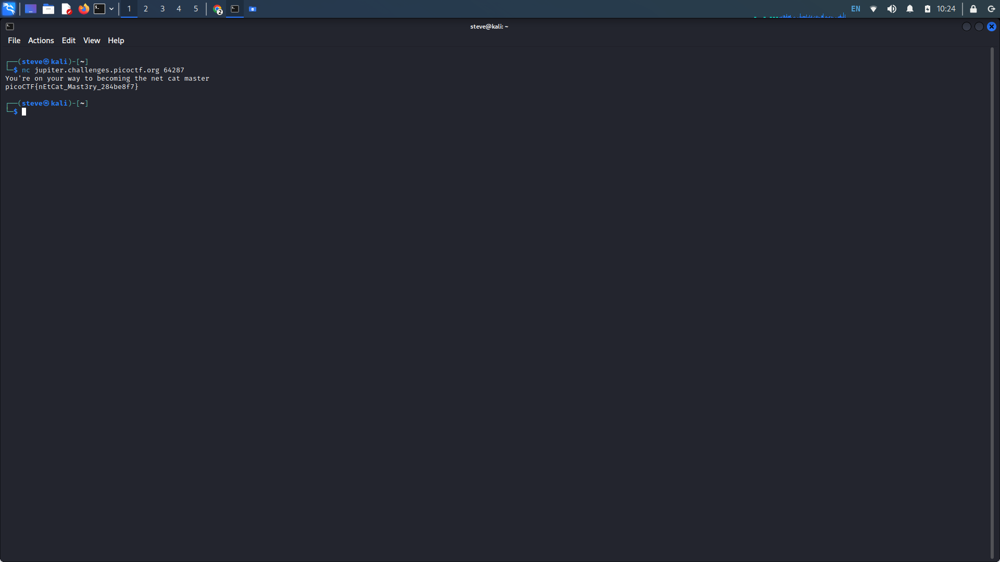
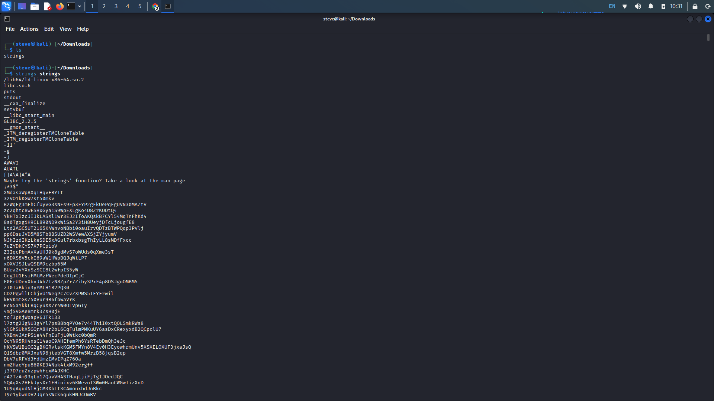
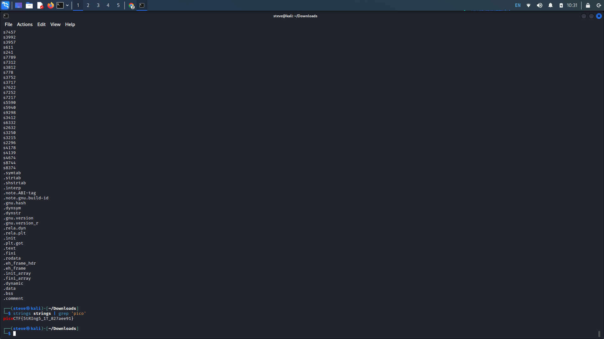
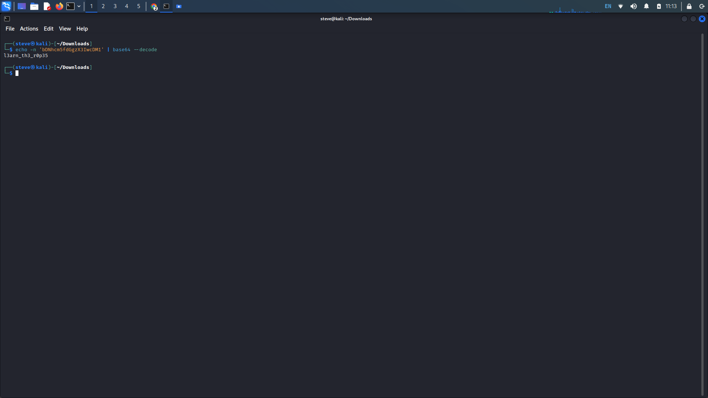
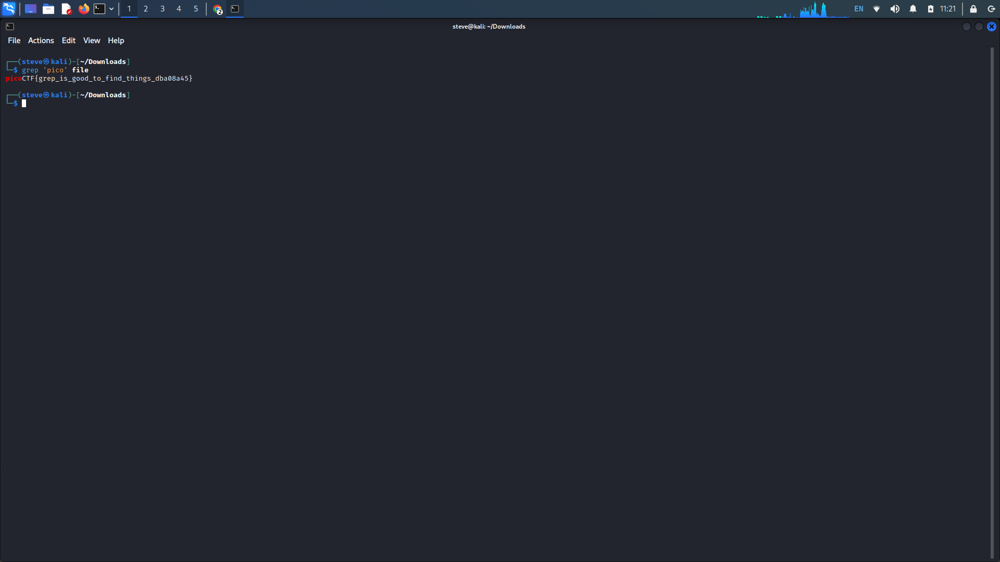
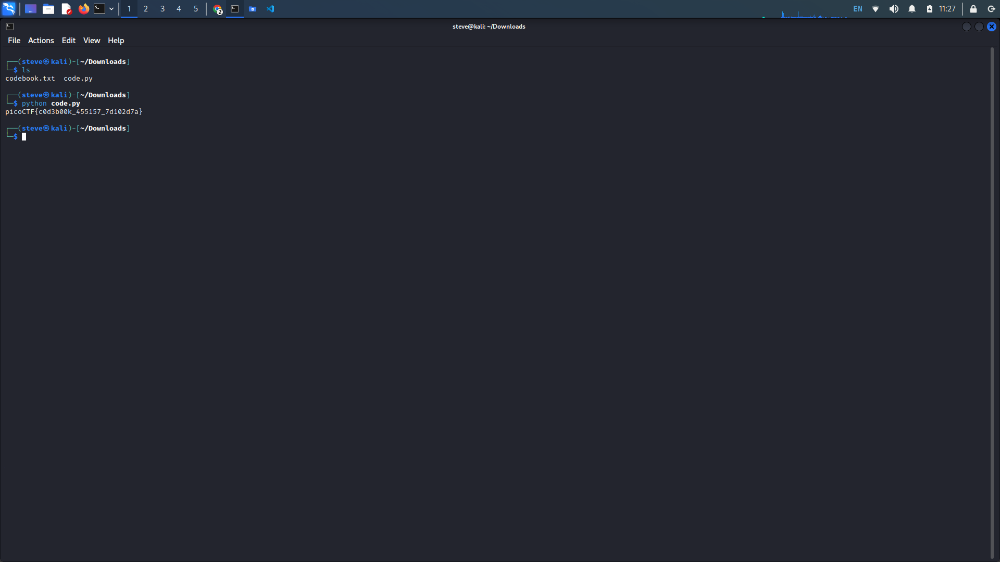

# PicoCTF General Skills: 11-15

## 11. What's a Net Cat?

Provided Hints:

nc [tutorial](https://linux.die.net/man/1/nc)

**Description:** Using netcat (nc) is going to be pretty important. Can you connect to `jupiter.challenges.picoctf.org` at port `64287` to get the flag?

This challenge has us utilize Netcat, a tool for reading from and writing to network connections using TCP or UDP.

To establish a connection type _nc_ followed by the address to connect to as well as the provided port number.&#x20;

<figure><figcaption></figcaption></figure>

## 12. Strings It

Provided Hints:

[strings](https://linux.die.net/man/1/strings)

**Description:** Can you find the flag in [file](https://jupiter.challenges.picoctf.org/static/5bd86036f013ac3b9c958499adf3e2e2/strings) without running it?

This level has us utilize the _strings_ command, this command prints the printable character sequences that are at least 4 characters long. Since we cannot specify what string to look for, we will have to utilize another command, _grep_. Grep is a command that can search for a specific pattern within files and strings.&#x20;

Type out the _strings_ command along with the name of the file we want to search. Then insert a pipe ("|"), the pipe character is used to chain different command together. Following the pipe, use the _grep_ command and insert the string we want to search by, which in this case would be anything similar to the flag.

&#x20;

<figure><figcaption></figcaption></figure>

<figure><figcaption></figcaption></figure>

## 13. Bases

Provided Hints:

Submit your answer in our flag format. For example, if your answer was 'hello', you would submit 'picoCTF{hello}' as the flag.

**Description:** What does this `bDNhcm5fdGgzX3IwcDM1` mean? I think it has something to do with bases.

This seems to be a base64 encoded string, ways to identify a base64 encoded string is as follows...

* **The length of a Base64-encoded string is always a multiple of 4**
* **Only these characters are used by the encryption: “A” to “Z”, “a” to “z”, “0” to “9”, “+” and “/”**
* **The end of a string can be padded up to two times using the “=”-character (this character is allowed in the end only)**

We could very easily search up a base64 decoder online, but two alternate ways would be through the command line or working it out yourself. To decode through the command line, _echo_ the string to the command line, then pipe it and use the _base64_ command with the --decode flag.

To decode base64, first remove any padding ("=") from the end of the base64 string. Then translate each base64 character back to their 6-bit binary representation. Finally, divide the bits into 8-bit chunks and translate the data back into its original format.

<figure><figcaption></figcaption></figure>

## 14. First Grep

Provided Hints:

grep [tutorial](https://ryanstutorials.net/linuxtutorial/grep.php)

**Description:** Can you find the flag in [file](https://jupiter.challenges.picoctf.org/static/495d43ee4a2b9f345a4307d053b4d88d/file)? This would be really tedious to look through manually, something tells me there is a better way.

Here we need to utilize _grep_ again. Use the _grep_ command followed by the string we wish to search for in quotes, and then the file we want to search.

<figure><figcaption></figcaption></figure>

## 15. Codebook

Provided Hints:

On the webshell, use `ls` to see if both files are in the directory you are in

The `str_xor` function does not need to be reverse engineered for this challenge.

**Description:**  Run the Python script `code.py` in the same directory as `codebook.txt`.

* [Download code.py](https://artifacts.picoctf.net/c/2/code.py)
* [Download codebook.txt](https://artifacts.picoctf.net/c/2/codebook.txt)

For this challenge, make sure both "code.py" and "codebook.txt" are in the same directory. Run "code.py" using the _python_ or _python3_ command. The python script will decode the string inside codebook for us.

<figure><figcaption></figcaption></figure>
