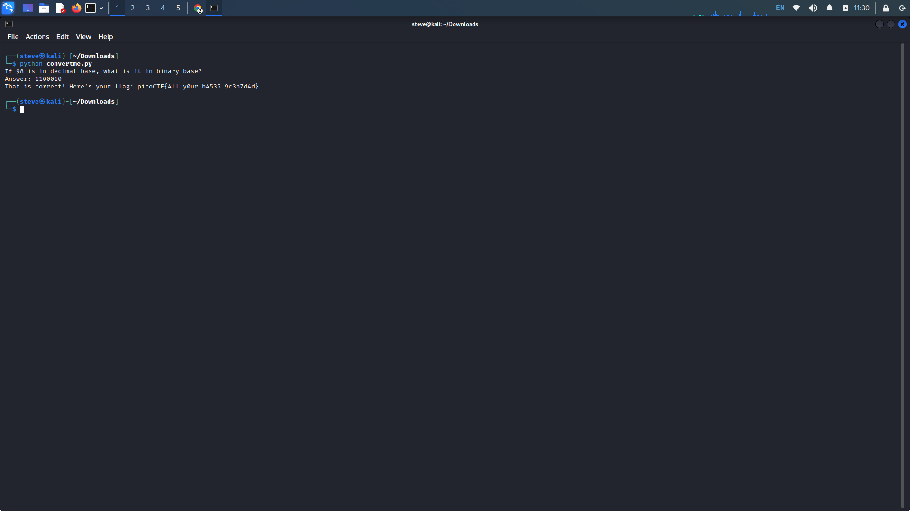
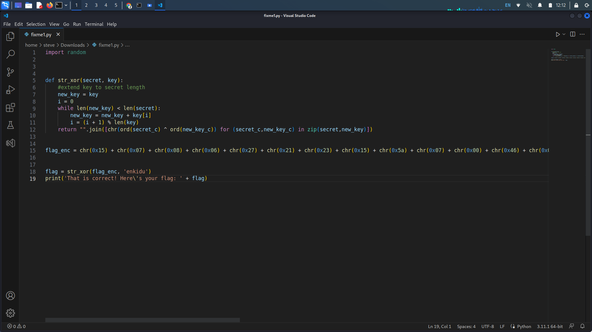
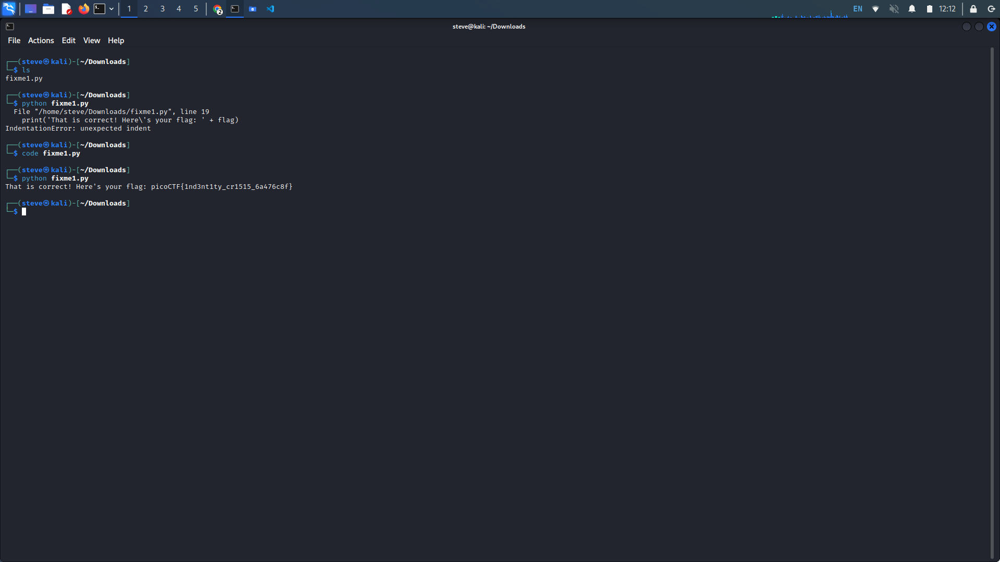
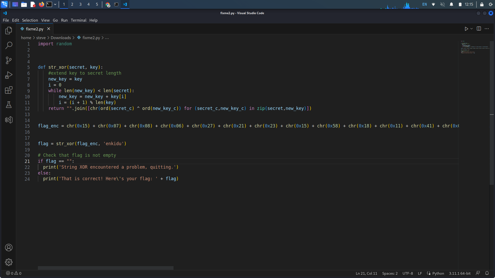
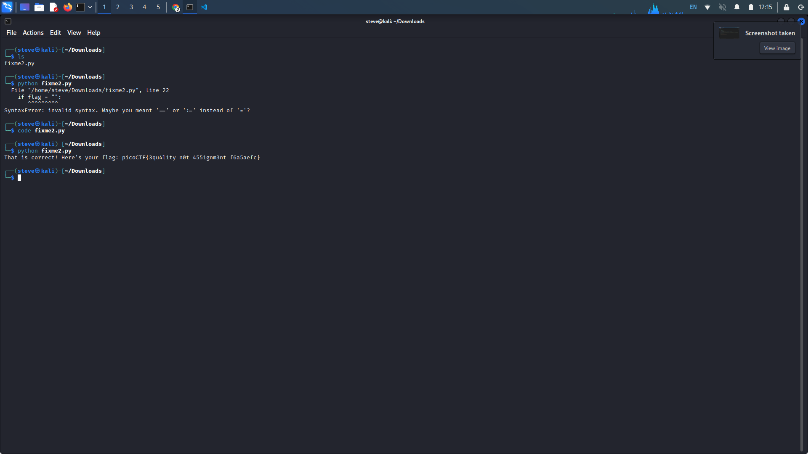
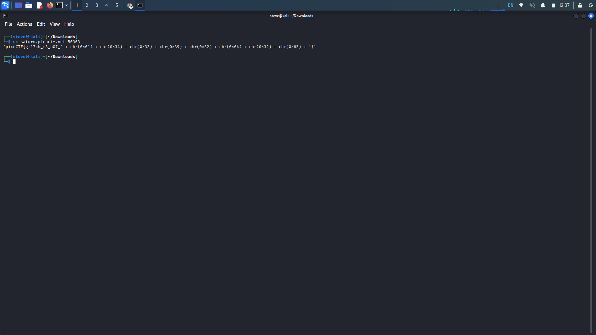
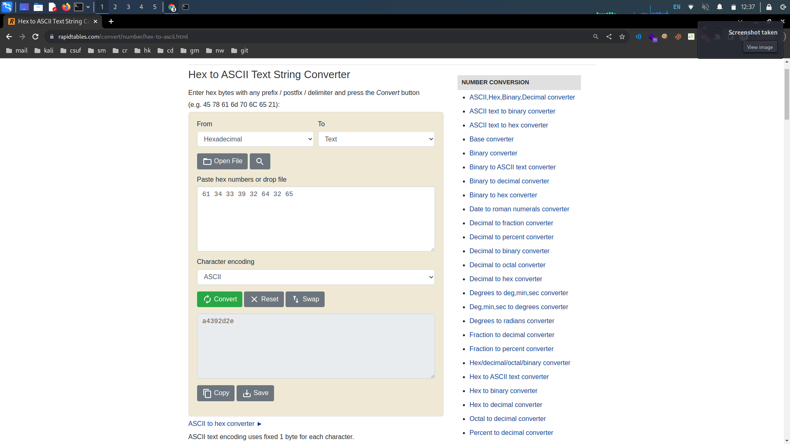
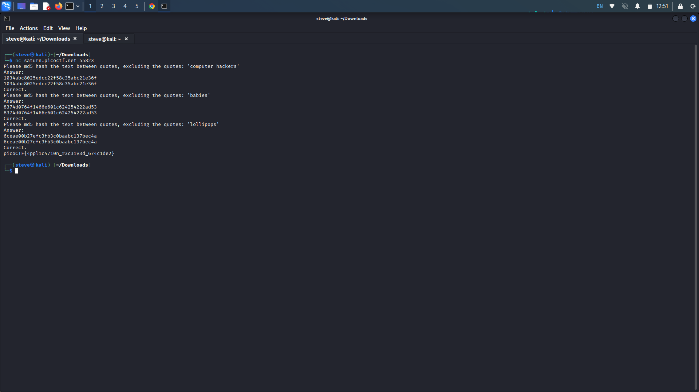
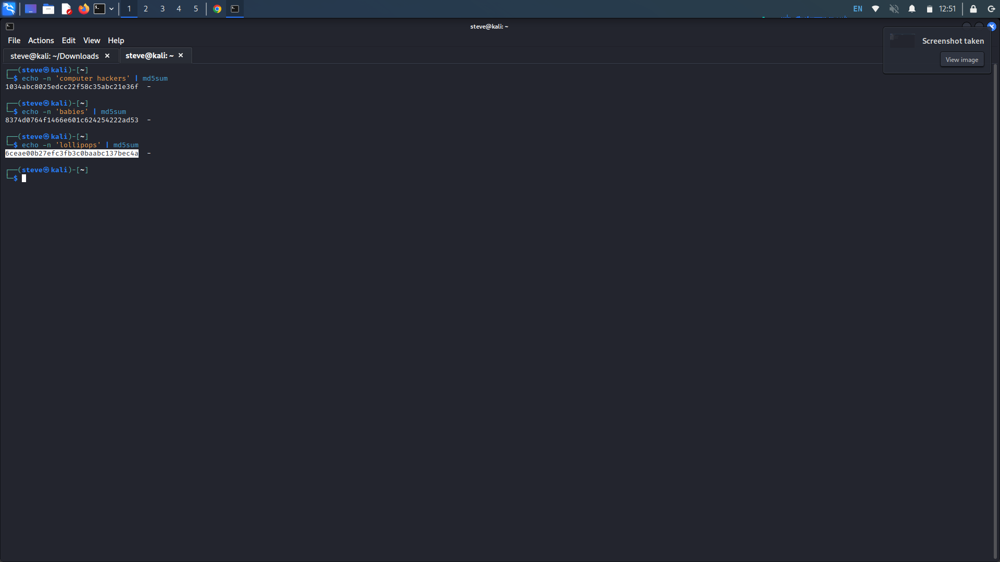

# PicoCTF General Skills: 16-20

## 16. Convertme.py

Provided Hints:

Look up a decimal to binary number conversion app on the web or use your computer's calculator!

The `str_xor` function does not need to be reverse engineered for this challenge.

If you have Python on your computer, you can download the script normally and run it. Otherwise, use the `wget` command in the webshell.

To use `wget` in the webshell, first right click on the download link and select 'Copy Link' or 'Copy Link Address'

Type everything after the dollar sign in the webshell: `$ wget` , then paste the link after the space after `wget` and press enter. This will download the script for you in the webshell so you can run it!

Finally, to run the script, type everything after the dollar sign and then press enter: `$ python3 convertme.py`

**Description:** Run the Python script and convert the given number from decimal to binary to get the flag. [Download Python script](https://artifacts.picoctf.net/c/23/convertme.py)

Upon downloading the python script, run the script with the _python_ command followed by the name of the script. The script will give you a number in decimal (base 10) to convert to binary (base 2).

To convert decimal to binary, keep dividing the decimal number until you get 0 as the quotient as shown in  [picoctf-general-skills-6-10.md](picoctf-general-skills-6-10.md "mention") #10. Enter the binary number and we are given the flag.

<figure><figcaption></figcaption></figure>

## 17. Fixme1.py

Provided Hints:

Indentation is very meaningful in Python

To view the file in the webshell, do: `$ nano fixme1.py`

To exit `nano`, press Ctrl and x and follow the on-screen prompts.

The `str_xor` function does not need to be reverse engineered for this challenge.

**Description:** Fix the syntax error in this Python script to print the flag. [Download Python script](https://artifacts.picoctf.net/c/25/fixme1.py)

Upon running the Python script, we are met with an IndentationError. This error is raised if there is an unexpected indentation somewhere within your code.

Using any text editor that can open Python code, we can fix the issue easily. Any program like _nano_, _gedit_, _idle_, or _vscode_ will work. Once the file is open with any editor, remove the indentation on the print line at the bottom of the code.

Save, exit the editor, and run the script once more. Now the script should return the flag.

<figure><figcaption></figcaption></figure>

<figure><figcaption></figcaption></figure>

## 18. Fixme2.py

Provided Hints:

Are equality and assignment the same symbol?

To view the file in the webshell, do: `$ nano fixme2.py`

To exit `nano`, press Ctrl and x and follow the on-screen prompts.

The `str_xor` function does not need to be reverse engineered for this challenge.

**Description:** Fix the syntax error in the Python script to print the flag. [Download Python script](https://artifacts.picoctf.net/c/6/fixme2.py)

Upon running this Python script, again, we are met with an error. This time we get a syntax error, the error is said to be on line 22 with the "if" statement.

Again, open the script in any editor and observe that on line 22, we are assigning flag to an empty string instead of checking if flag is an empty string. In Python and many other languages, one equal sign ("=") is an assignment operator, while two equal signs ("==") is the equal to operator.

Change the assignment operator to the equal to operator, save the program and re-run it for the flag.

<figure><figcaption></figcaption></figure>

<figure><figcaption></figcaption></figure>

## 19. Glitch Cat

Provided Hints:

ASCII is one of the most common encodings used in programming

We know that the glitch output is valid Python, somehow!

Press Ctrl and c on your keyboard to close your connection and return to the command prompt.

**Description:** Our flag printing service has started glitching!`$ nc saturn.picoctf.net 50363`

Copy and paste the Netcat command to your command line. When we execute the command, we are met with part of the flag. We see hexadecimal characters following the part of the flag, we can see this from the "0x" before each number.

We need to convert these hex characters their ASCII counterpart. Search up a converter and combine the parts of the flag.

<figure><figcaption></figcaption></figure>

<figure><figcaption></figcaption></figure>

## 20. HashingJobApp

Provided Hints:

You can use a commandline tool or web app to hash text

Press Ctrl and c on your keyboard to close your connection and return to the command prompt.

**Description:** If you want to hash with the best, beat this test!`nc saturn.picoctf.net 55823`&#x20;

Upon executing the Netcat command, we are told to md5 hash the given string. Search up an md5 hash generator or we could do this through the command line.&#x20;

To hash the text through the command line, open another terminal window (ctrl + shift + t). Echo the string you wish to echo with the -n flag and pipe the _md5sum_ command.&#x20;

E.g. echo -n 'clowns' | md5sum

Copy (ctrl + shift + c) and paste (ctrl + shift +v) the md5 hash that was generated into the answer field.

<figure><figcaption></figcaption></figure>

<figure><figcaption></figcaption></figure>
