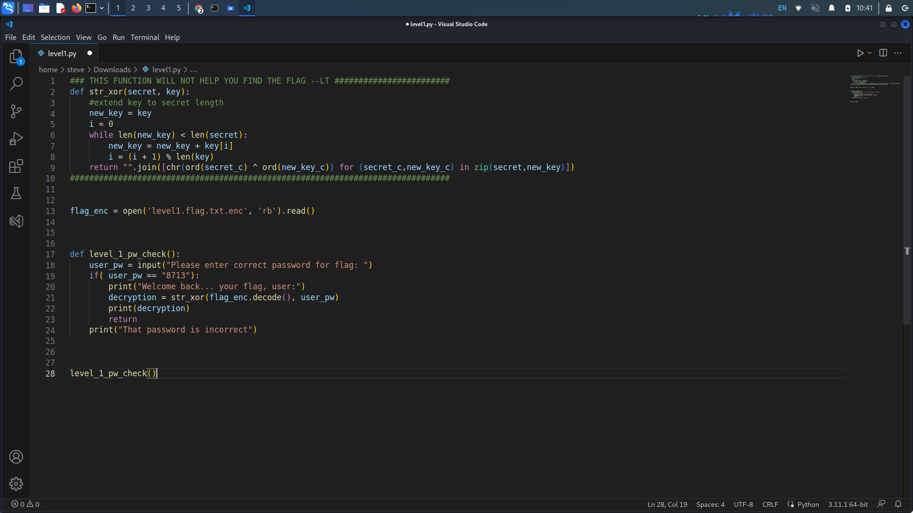
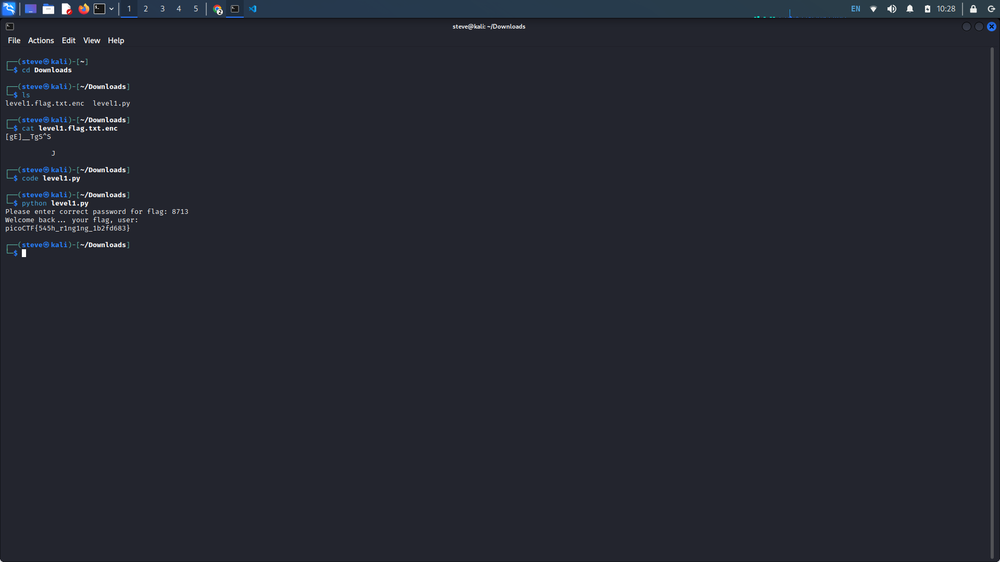
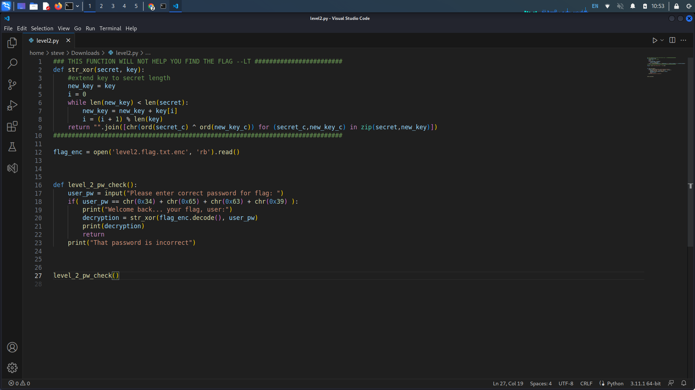
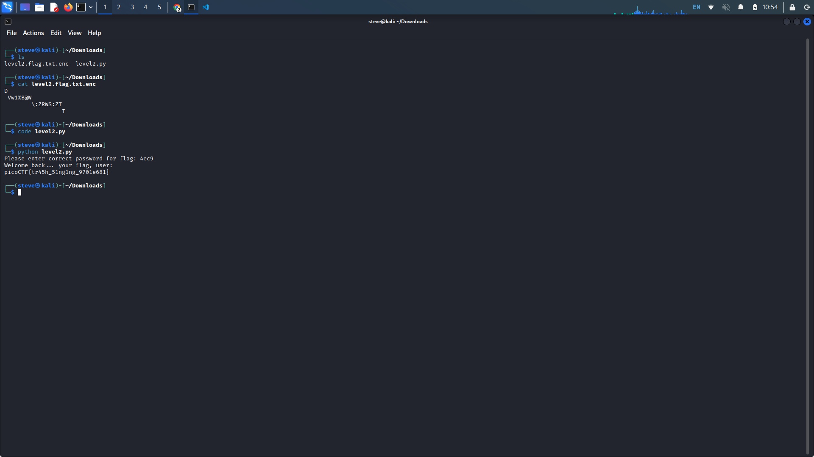
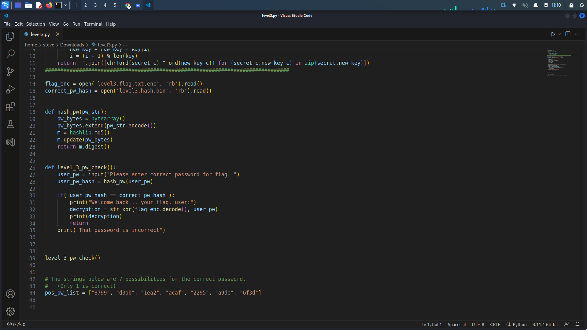
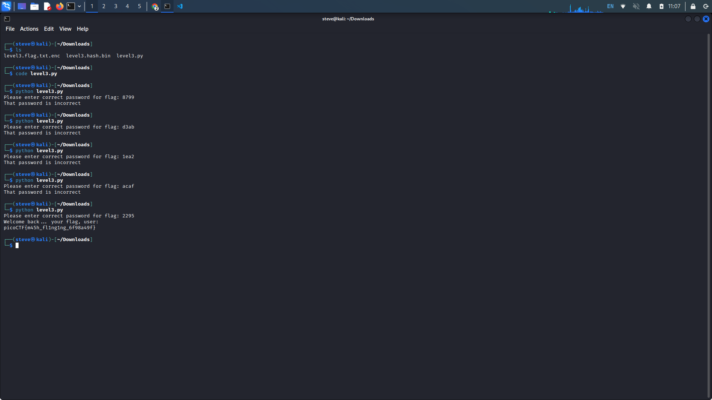
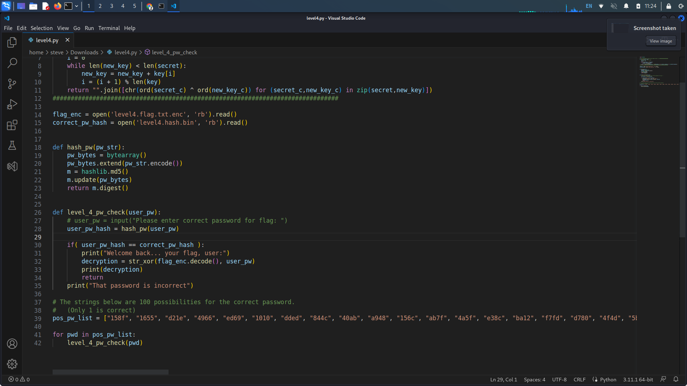
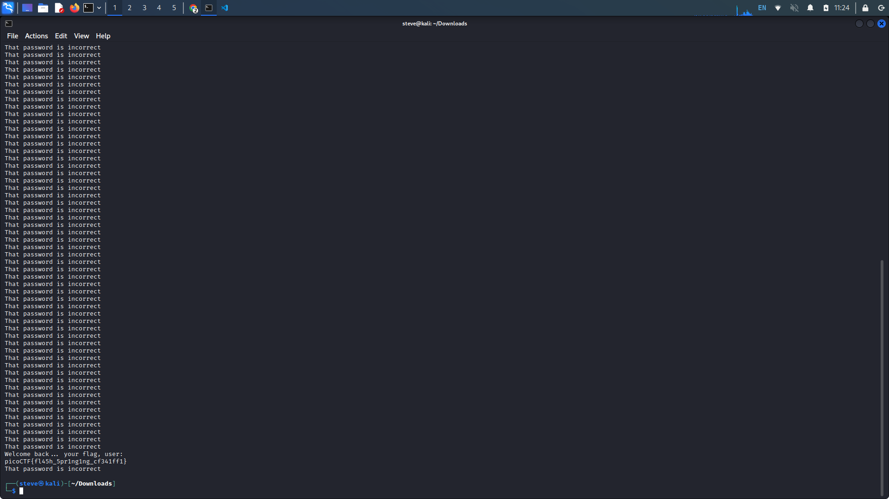
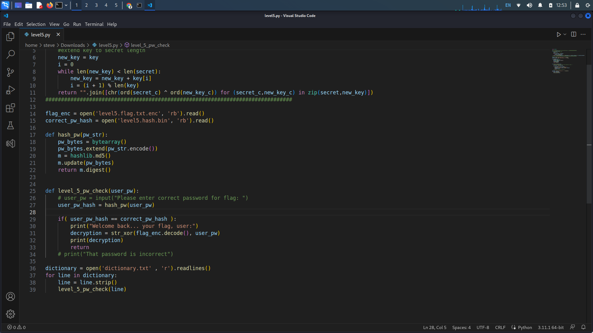
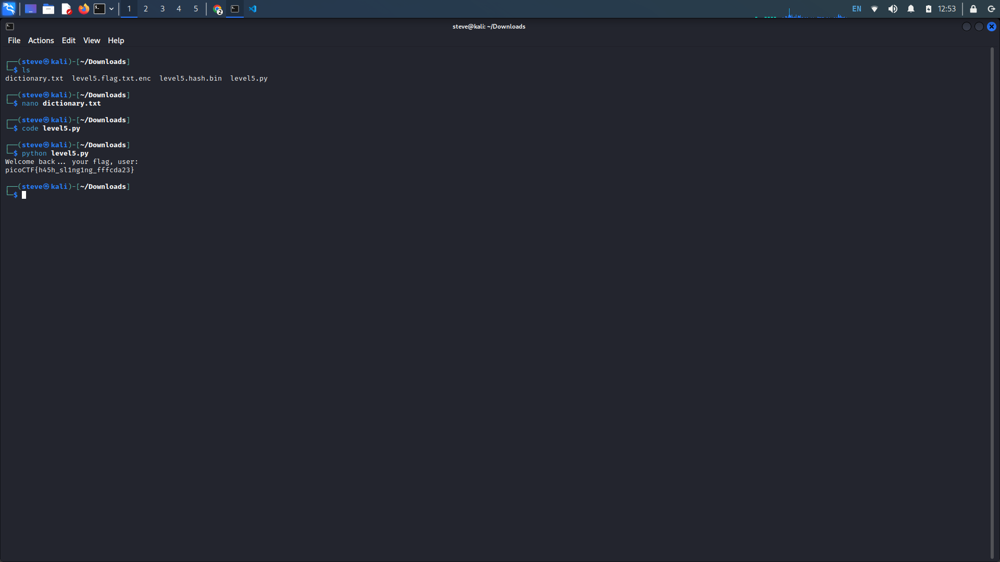

# PicoCTF General Skills: 21-25

## 21. PW Crack 1

<details>

<summary>Provided Hints:</summary>

To view the file in the webshell, do: `$ nano level1.py`

To exit `nano`, press Ctrl and x and follow the on-screen prompts.

The `str_xor` function does not need to be reverse engineered for this challenge.

</details>

**Description:** Can you crack the password to get the flag? Download the password checker [here](https://artifacts.picoctf.net/c/12/level1.py) and you'll need the encrypted [flag](https://artifacts.picoctf.net/c/12/level1.flag.txt.enc) in the same directory too.

After having downloaded both files, make sure they are in the same directory. We won't get much information from the encrypted file, so we must analyze the Python script.

We see a couple important details within the code, the str\_xor function and the level\_1\_pw\_check function. The str\_xor seems to be what will give us our flag, and the level\_1\_pw\_check checks if our password is correct.&#x20;

In the level\_1\_pw\_check function, we see an if statement that checks if our entered password is equal to a given string. If we match this string when entering the password, the script will execute the str\_xor function, giving us our flag.

Run the Python script and enter the password.

<figure><figcaption></figcaption></figure>

<figure><figcaption></figcaption></figure>

## 22. PW Crack 2

<details>

<summary>Provided Hints:</summary>

Does that encoding look familiar?

The `str_xor` function does not need to be reverse engineered for this challenge.

</details>

**Description:** Can you crack the password to get the flag? Download the password checker [here](https://artifacts.picoctf.net/c/14/level2.py) and you'll need the encrypted [flag](https://artifacts.picoctf.net/c/14/level2.flag.txt.enc) in the same directory too.

Like our last challenge, analyze the contents of the Python script with an editor. Again, we see a condition for checking the password the user inputs. This time, the password is in hexadecimal form. Convert the hex to decimal and enter the password.

<figure><figcaption></figcaption></figure>

<figure><figcaption></figcaption></figure>

## 23. PW Crack 3

<details>

<summary>Provided Hints:</summary>

To view the level3.hash.bin file in the webshell, do: `$ bvi level3.hash.bin`

To exit `bvi` type `:q` and press enter.

The `str_xor` function does not need to be reverse engineered for this challenge.

</details>

**Description:** Can you crack the password to get the flag? Download the password checker [here](https://artifacts.picoctf.net/c/18/level3.py) and you'll need the encrypted [flag](https://artifacts.picoctf.net/c/18/level3.flag.txt.enc) and the [hash](https://artifacts.picoctf.net/c/18/level3.hash.bin) in the same directory too. There are 7 potential passwords with 1 being correct. You can find these by examining the password checker script.

This time, we are given a script, the encoded flag, and a hash. Reverse engineering this hash is not feasible but, we can analyze the Python script again.

Open the script with any text editor, at the bottom of the module, we can see the 7 possible password strings. Input each one into the password field in the command line until you get the flag.

<figure><figcaption></figcaption></figure>

<figure><figcaption></figcaption></figure>

## 24. PW Crack 4

<details>

<summary>Provided Hints:</summary>

A for loop can help you do many things very quickly.

The `str_xor` function does not need to be reverse engineered for this challenge.

</details>

**Description:** Can you crack the password to get the flag?Download the password checker [here](https://artifacts.picoctf.net/c/20/level4.py) and you'll need the encrypted [flag](https://artifacts.picoctf.net/c/20/level4.flag.txt.enc) and the [hash](https://artifacts.picoctf.net/c/20/level4.hash.bin) in the same directory too. There are 100 potential passwords with only 1 being correct. You can find these by examining the password checker script.

This time, it looks like we need to reverse engineer the Python script. Since we are now given a significantly larger number of possible passwords we must alter the script.

Using a for loop, we can expedite the password checking process. Create a for loop at the bottom of the module as we'll need to make use of both the level\_4\_pw\_check function and the passwords list. We need to utilize the for loop to iterate through the list of 100 possible passwords. With each iteration, call the level\_4\_pw\_check function with the iterative as the argument.

````python
```python
for pwd in pos_pw_list:
    level_4_pw_check(pwd)
```
````

With this change, we now need to alter the level\_4\_pw\_check function, include user\_pw as the parameter for the level\_4\_pw\_check function so the function uses the iterated passwords in place of user\_pw. Now, comment out the line that requests the user for input as we do not need it anymore.

````
```python
def level_4_pw_check(user_pw):
    # user_pw = input("Please enter correct password for flag: ")
    user_pw_hash = hash_pw(user_pw)
```
````

Now run the script.

<figure><figcaption></figcaption></figure>

<figure><figcaption></figcaption></figure>

## 25. PW Crack 5

<details>

<summary>Provided Hints:</summary>

Opening a file in Python is crucial to using the provided dictionary.

You may need to trim the whitespace from the dictionary word before hashing. Look up the Python string function, `strip`

The `str_xor` function does not need to be reverse engineered for this challenge.

</details>

**Description:** Can you crack the password to get the flag? Download the password checker [here](https://artifacts.picoctf.net/c/33/level5.py) and you'll need the encrypted [flag](https://artifacts.picoctf.net/c/33/level5.flag.txt.enc) and the [hash](https://artifacts.picoctf.net/c/33/level5.hash.bin) in the same directory too. Here's a [dictionary](https://artifacts.picoctf.net/c/33/dictionary.txt) with all possible passwords based on the password conventions we've seen so far.

Download all 4 files, this time, we are given a dictionary to use in our script. Upon reading the text file, we see tens of thousands of possible passwords. We need to find a way to read this file to Python and iterate through the passwords.

Open the script in any text editor, we must first open the file in Python. Under the str\_xor function, we observe how we can open files in Python. We need to utilize the level\_5\_pw\_checker in our for loop so we need to start writing code under the function. Start by opening the file with read permissions.

````
```python
dictionary = open('dictionary.txt' , 'r').readlines()
```
````

We open the file with 'r'  (read) permissions instead of the previously shown 'rb' (read bytes) permissions as we want to read this text file normally. Additionally, instead of .read() we use .readlines() in order to return the lines of the file as a list of strings.

Now we can iterate through our list, use a for loop to iterate through our dictionary. Recall to when we first observed the dictionary.txt file, after every possible password, the subsequent one would be on a next line. This would mean there would be a newline character (e.g. "\n") being read after every possible password. Because of this, we need to utilize the .strip() function with every line in our list.&#x20;

````
```python
for line in dictionary:
    line = line.strip()
```
````

Now we can call the level\_5\_pw\_check our line.

````
```python
    level_5_pw_check(line)
```
````

Like our last challenge, use user\_pw as the parameter and comment out our user input request. Additionally, comment out the incorrect password print line and we are done.

````
```python
def level_5_pw_check(user_pw):
    # user_pw = input("Please enter correct password for flag: ")
    user_pw_hash = hash_pw(user_pw)
    
    if( user_pw_hash == correct_pw_hash ):
        print("Welcome back... your flag, user:")
        decryption = str_xor(flag_enc.decode(), user_pw)
        print(decryption)
        return
    # print("That password is incorrect")
```
````

Run the script once more for our flag.

<figure><figcaption></figcaption></figure>

<figure><figcaption></figcaption></figure>
