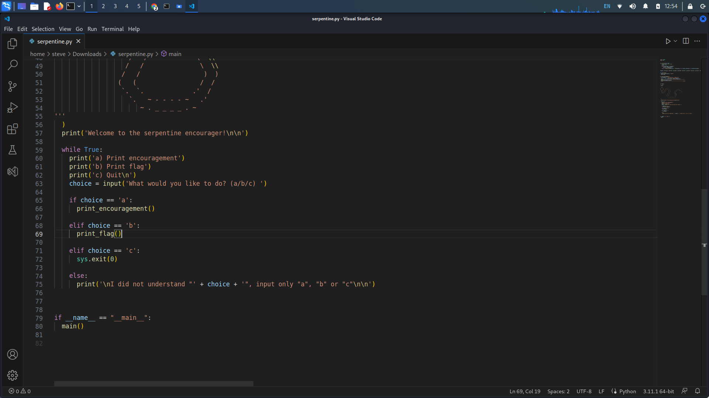
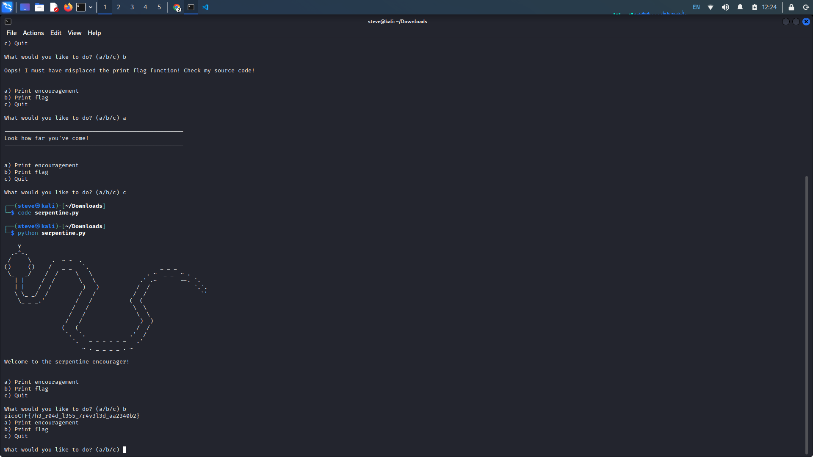
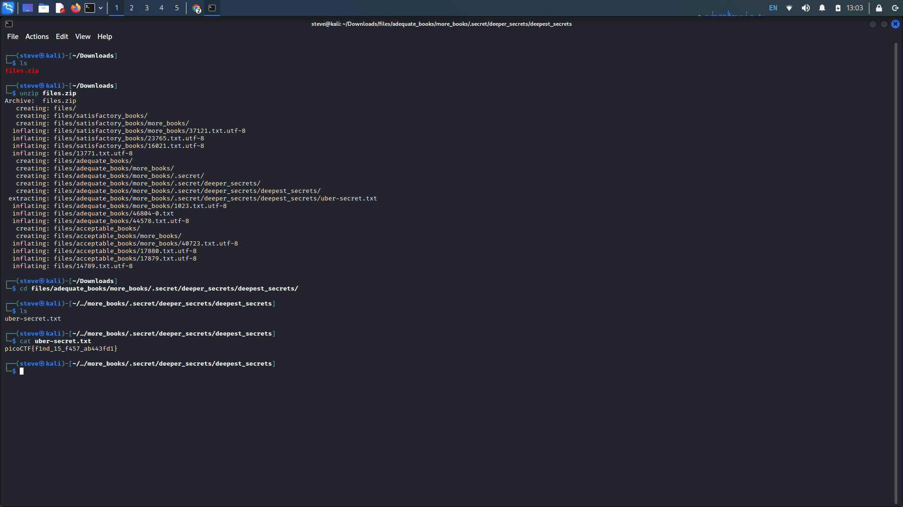
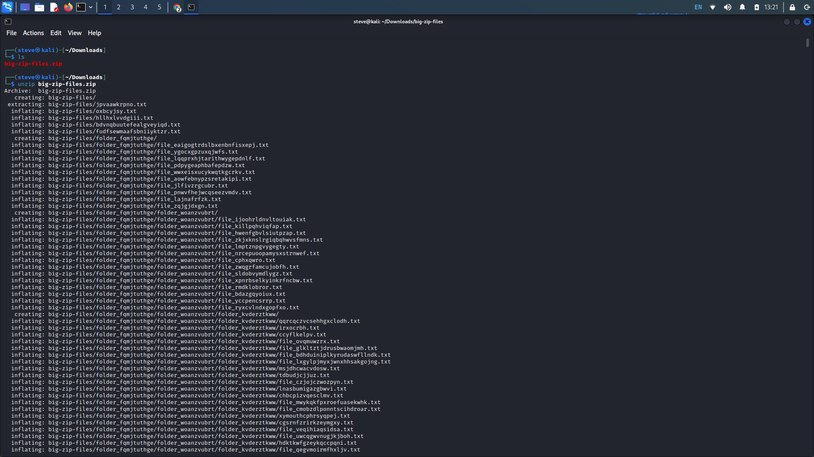
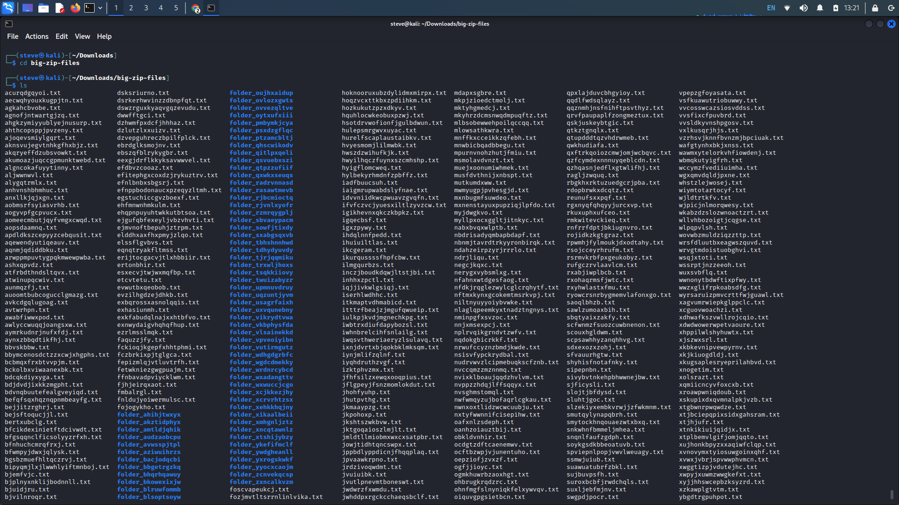
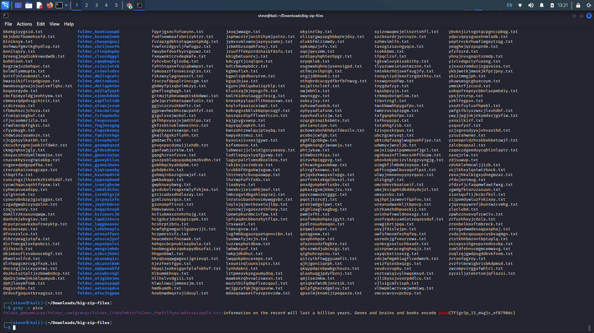
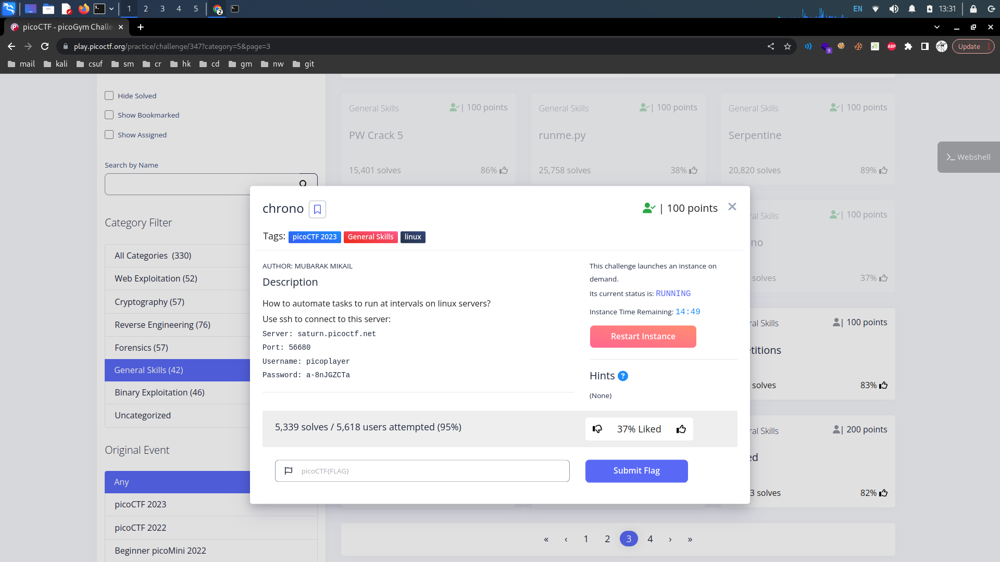
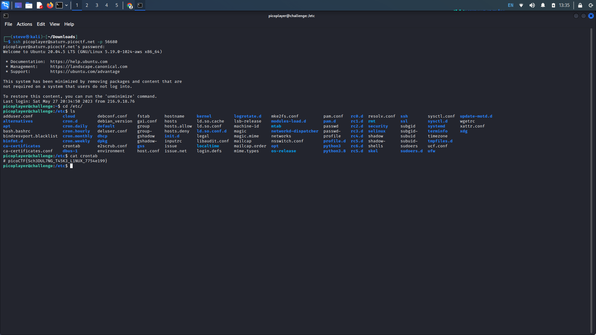

# PicoCTF General Skills: 26-30

## 26. Runme.py

Provided Hints:

If you have Python on your computer, you can download the script normally and run it. Otherwise, use the `wget` command in the webshell.

To use `wget` in the webshell, first right click on the download link and select 'Copy Link' or 'Copy Link Address'

Type everything after the dollar sign in the webshell: `$ wget` , then paste the link after the space after `wget` and press enter. This will download the script for you in the webshell so you can run it!

Finally, to run the script, type everything after the dollar sign and then press enter: `$ python3 runme.py` You should have the flag now!

**Description:** Run the `runme.py` script to get the flag. Download the script with your browser or with `wget` in the webshell. [Download runme.py Python script](https://artifacts.picoctf.net/c/34/runme.py)

Odd placement for this challenge...&#x20;

All you have to do is run the script with the _python_ command.

<figure><figcaption></figcaption></figure>

## 27. Serpentine

Provided Hints:

Try running the script and see what happens

In the webshell, try examining the script with a text editor like `nano`

To exit `nano`, press Ctrl and x and follow the on-screen prompts.

The `str_xor` function does not need to be reverse engineered for this challenge.

**Description:** Find the flag in the Python script! [Download Python script](https://artifacts.picoctf.net/c/36/serpentine.py)

Upon running the Python script, when we request the flag, we are met with a message that prompts you to check the source code.

Open the script in any code/text editor, there are two main areas where there might be an issue. One could the be print flag function, and another can be the output for when a user inputs the 'b' option.&#x20;

There doesn't seem to be anything wrong with the print\_flag function so we should check the menu choice option. When we check the elif statement for 'b', we see that instead of calling the print\_flag function, the script just prints a message.

Change the print message to a function call for print\_flag.

<figure><figcaption></figcaption></figure>

<figure><figcaption></figcaption></figure>

## 28. First Find

Provided Hints:

(None)

**Description:** Unzip this archive and find the file named 'uber-secret.txt'. [Download zip file](https://artifacts.picoctf.net/c/501/files.zip)

Download the zip file and unzip the file with the _unzip_ command. When the file is unzipped, we see a list directories and files. Look for the 'uber-secret.txt' file and copy the directory that leads to the file.&#x20;

Cat the 'uber-secret.txt' file for the flag.

<figure><figcaption></figcaption></figure>

## 29. Big Zip

Provided Hints:

Can grep be instructed to look at every file in a directory and its subdirectories?

**Description:** Unzip this archive and find the flag. [Download zip file](https://artifacts.picoctf.net/c/505/big-zip-files.zip)

Unzip the downloaded file. This time, there are too many directories and files in the zip file to manually search for the flag.

Similarly to [#14.-first-grep](picoctf-general-skills-11-15.md#14.-first-grep "mention"), we can utilize _grep_ to search through all the files, directories, and sub-directories. Using _grep_ along with the '-r' (recursive) flag, along with 'pico' as the pattern we wish to search for, we can recursively search through all the directories.

Copy the flag output from the grep command.

<figure><figcaption></figcaption></figure>

<figure><figcaption></figcaption></figure>

<figure><figcaption></figcaption></figure>

## 30. Chrono

Provided Hints:

(None)

**Description:** How to automate tasks to run at intervals on linux servers? Additional details will be available after launching your challenge instance.

Launch the ssh instance in the challenge window. After launching the instance, we are given a username, sever, port, and password.&#x20;

SSH connection syntax goes as follows, (username)@(server) and optionally -p (port). Enter the given information in this order. According to the description, we are looking for an automated task on the server.

To find the list of automated commands we wont to run on a regular schedule, we must locate the 'crontab' file. The file is located in the 'etc' directory. cd to the directory and cat the 'crontab' file.

<figure><figcaption></figcaption></figure>

<figure><figcaption></figcaption></figure>
