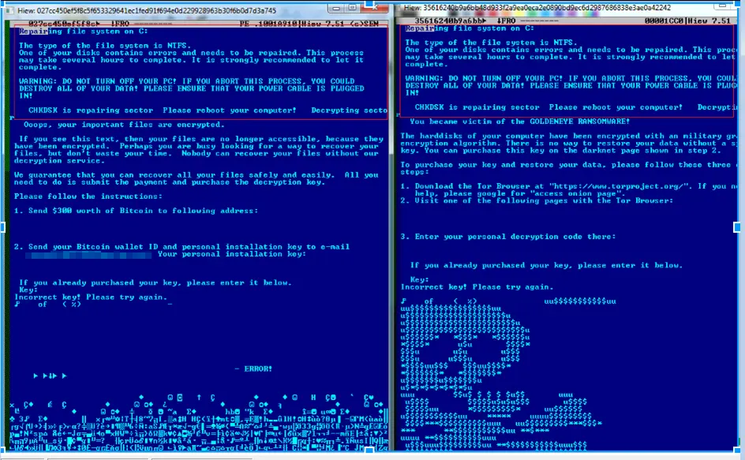
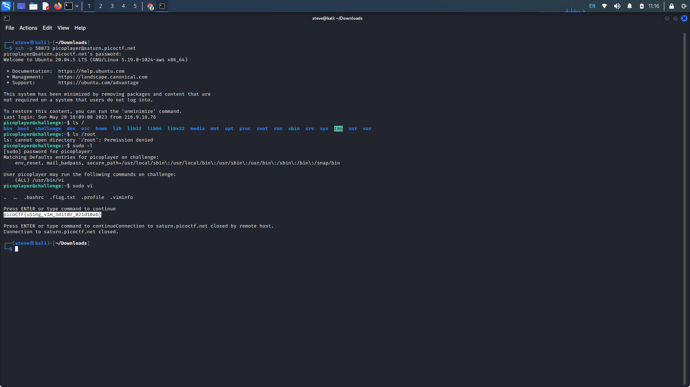
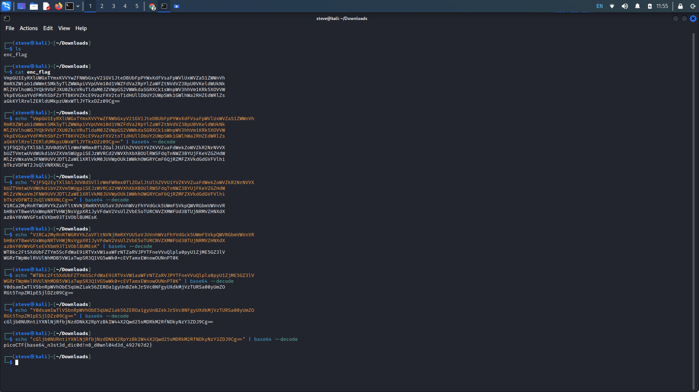
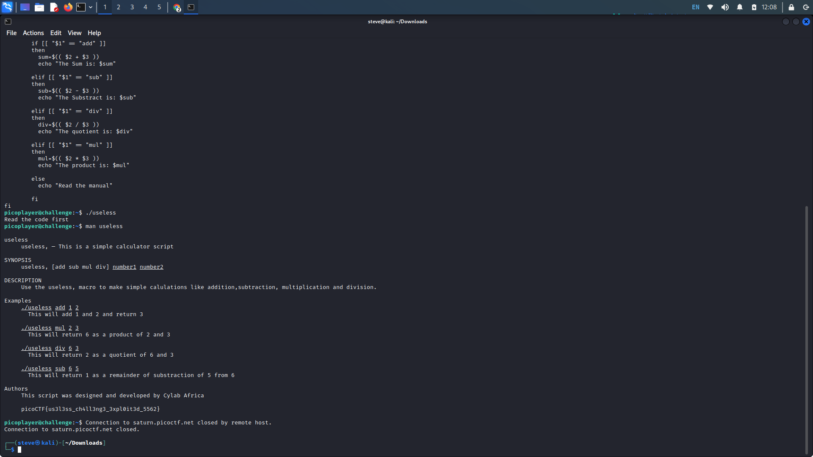
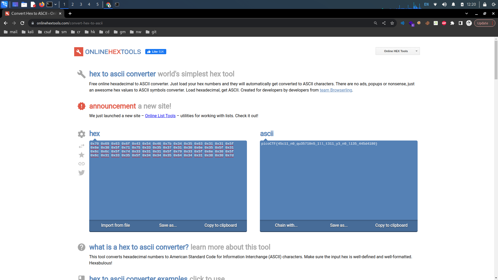

# PicoCTF General Skills: 31-35

## 31. Money-ware

Provided Hints

Some crypto-currencies abuse databases exist; check them out!

Maybe Google might help.

**Description:** The first letter of the malware name should be capitalized and the rest lowercase.Your friend just got hacked and has been asked to pay some bitcoins to `1Mz7153HMuxXTuR2R1t78mGSdzaAtNbBWX`. He doesn’t seem to understand what is going on and asks you for advice. Can you identify what malware he’s being a victim of?

Searching up the provided Bitcoin wallet shows results regarding a family of encrypting malware that was first discovered in 2016. The name of this malware was "Petya" and it encrypted files on your computer, demanding crypto as ransom.

<figure><figcaption></figcaption></figure>

## 32. Permissions

Provided Hints:

(None)

**Description:** Can you read files in the root file? Additional details will be available after launching your challenge instance.

Launch the instance and connect through the provided ssh command. When the connection is established, _ls_ (list) or _cd_ (change directory) into the "/" (root) directory, which contains all the files and directories in the system.

Attempt to _ls_ or _cd_ into the root directory and notice that we do not have adequate permissions to do so. To see what commands are available to use utilize the _sudo -l_ command that will list them. We see that we have access to vi (vim), vim is the default editor that comes with UNIX operating systems. We can use vim to execute commands through its command mode.&#x20;

Open vim with _sudo_ to be able to execute superuser commands through vim. To run commands through vim preface each command with ":!". Execute _:! ls -a /root_ to list all files, including hidden files, within the root directory. We see the flag file, press enter to execute another command through vim. Next execute _:! cat /root/.flag.txt_ for the flag.

<figure><figcaption></figcaption></figure>

## 33. Repetitions

Provided Hints:

**Description:** Can you make sense of this file? Download the file [here](https://artifacts.picoctf.net/c/475/enc\_flag).

Download the encrypted flag and concatenate the file. Similar to what we did in [#13.-bases](picoctf-general-skills-11-15.md#13.-bases "mention"), echo the encrypted flag, using a pipe ("|") to also decode it with _base64_.

Continue decoding each decoded string to eventually reach the flag.

<figure><figcaption></figcaption></figure>

## 34. Useless

Provided Hints:

(None)

**Description:** There's an interesting script in the user's home directory. Additional details will be available after launching your challenge instance.

Launch the instance in the challenge window and list the files in the home directory. We have one executable file, if we try to execute the file with "./", we are told to read the code first.

We can cat the executable and towards the end of the code, we see an echo telling us to read the manual. Check the manual for the script with man _"filename"_ to see the flag under the stated authors.

<figure><figcaption></figcaption></figure>

## 35. ASCII Numbers

Provided Hints:

CyberChef is a great tool for any encoding but especially ASCII.

Try CyberChef's 'From Hex' function

**Description:** Convert the following string of ASCII numbers into a readable string:`0x70 0x69 0x63 0x6f 0x43 0x54 0x46 0x7b 0x34 0x35 0x63 0x31 0x31 0x5f 0x6e 0x30 0x5f 0x71 0x75 0x33 0x35 0x37 0x31 0x30 0x6e 0x35 0x5f 0x31 0x6c 0x6c 0x5f 0x74 0x33 0x31 0x31 0x5f 0x79 0x33 0x5f 0x6e 0x30 0x5f 0x6c 0x31 0x33 0x35 0x5f 0x34 0x34 0x35 0x64 0x34 0x31 0x38 0x30 0x7d`

Decode the given hex string to ASCII to get the flag. Search up any hex to ASCII converter, one that will ignore the 0x prefix.

I used [https://onlinehextools.com/convert-hex-to-ascii](https://onlinehextools.com/convert-hex-to-ascii).

<figure><figcaption></figcaption></figure>
