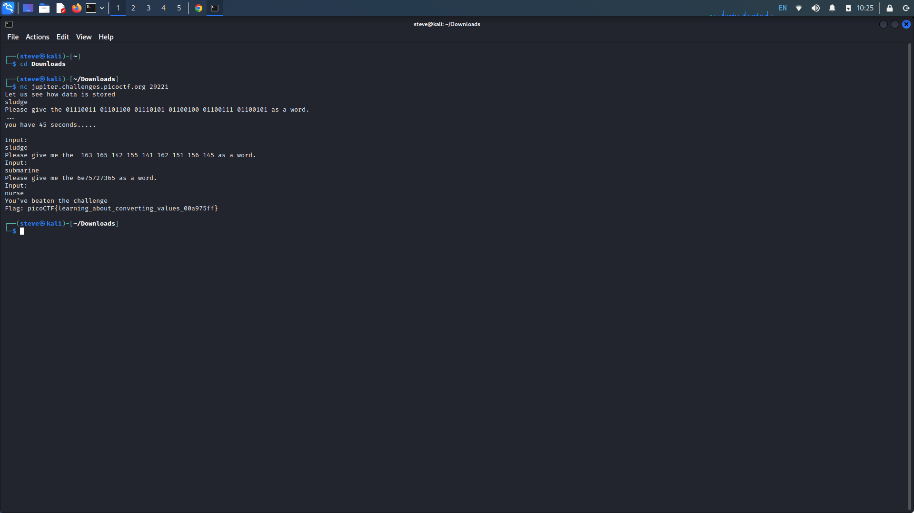
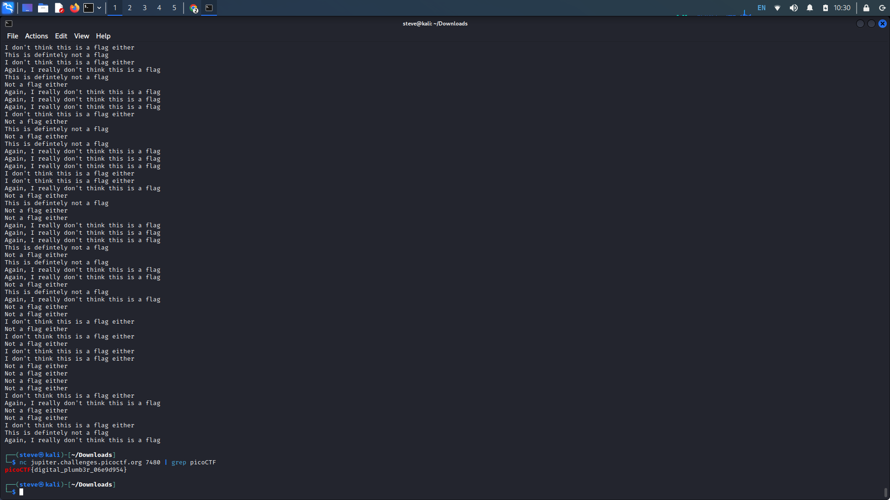
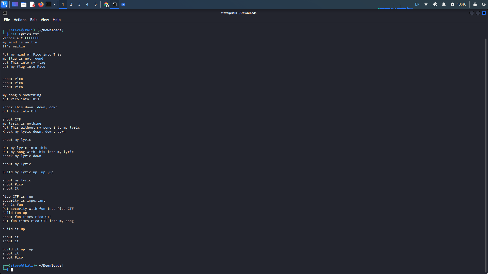
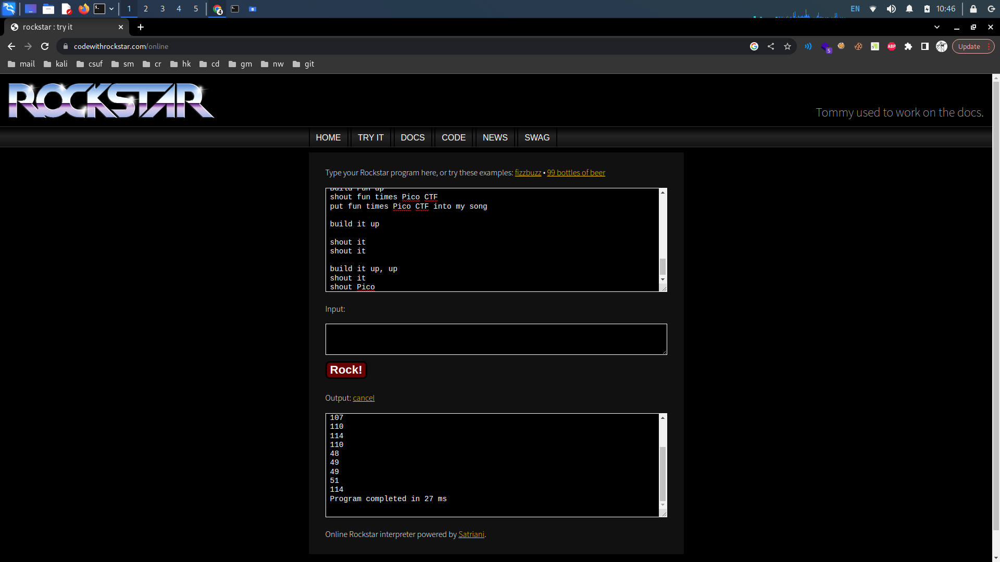
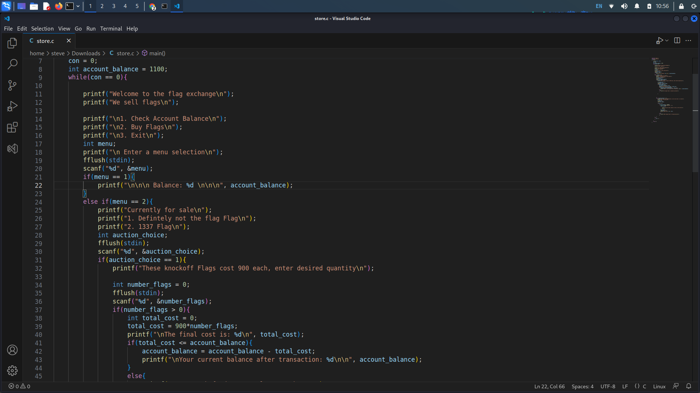
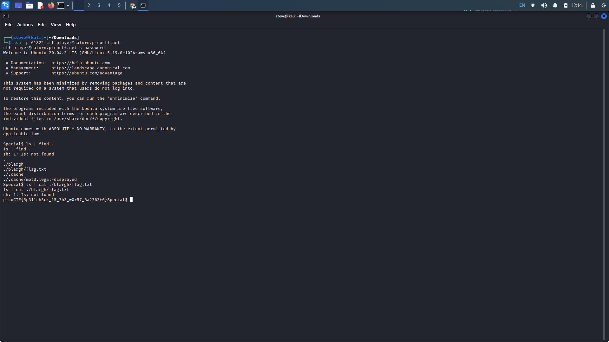

# PicoCTF General Skills: 36-40

## 36. Based

Provided Hints:

I hear python can convert things.

It might help to have multiple windows open.

**Description:** To get truly 1337, you must understand different data encodings, such as hexadecimal or binary. Can you get the flag from this program to prove you are on the way to becoming 1337? Connect with `nc jupiter.challenges.picoctf.org 29221`.

Connect to server provided through Netcat. Copy the provided command and open any base converter. For this challenge, I used [rapidtables](https://www.rapidtables.com/convert/number/binary-to-ascii.html).&#x20;

Enter the provided command and convert the given strings.

<figure><figcaption></figcaption></figure>

## 37. Plumbing

Provided Hints:

Remember the flag format is picoCTF{XXXX}

What's a pipe? No not that kind of pipe... This [kind](http://www.linfo.org/pipes.html)

**Description:** Sometimes you need to handle process data outside of a file. Can you find a way to keep the output from this program and search for the flag? Connect to `jupiter.challenges.picoctf.org 7480.`

Upon connecting to the provided server through Netcat, we are met with hundreds of lines of strings. We don't want to look through this manually so once again, we can use _grep_.

Write out the Netcat server connection once more but this time pipe this command with a _grep_ command following the string we want to look for. In this case "picoCTF". Like we did in [#12.-strings-it](picoctf-general-skills-11-15.md#12.-strings-it "mention").

<figure><figcaption></figcaption></figure>

## 38. Mus1c

Provided Hints:

Do you think you can master rockstar?

**Description:** I wrote you a [song](https://jupiter.challenges.picoctf.org/static/c594d8d915de0129d92b4c41e25a2313/lyrics.txt). Put it in the picoCTF{} flag format.

Download the text file and _cat_ it. Looking at the output from the file, and through the given hint, this seems to be from Rockstar. Rockstar is "computer programming language designed for creating programs that are also hair metal power ballads."

Further research will lead you to their official page [Rockstar](https://codewithrockstar.com/). Navigate to the "Try It" tab and copy and paste the lyrics. The interpreter seems to have output ASCII text. Find any ASCII to text converter to receive the flag.

<figure><figcaption></figcaption></figure>

<figure><figcaption></figcaption></figure>

## 39. Flag\_shop

Provided Hints:

Two's compliment can do some weird things when numbers get really big!

**Description:** There's a flag shop selling stuff, can you buy a flag? [Source](https://jupiter.challenges.picoctf.org/static/64e724ad327f83ad833d9c6baa072b1f/store.c). Connect with `nc jupiter.challenges.picoctf.org 4906`.

Analyze the provided Source code of the program that is run upon successful connection to the server. Looking through the source code, notice these...

* The use of the int data type for the total\_cost variable **(line 38)**
* The multiplication of 900 to the number\_of\_flags variable **(line 39)**
* If total cost is less than or equal to account balance, new account balance equals account balance - total cost **(lines 41, 42)**

In C, a 32-bit int's range of value is -2,147,483,648 to 2,147,483,647. If our multiplication of flags exceeded the range of values allowed, it will overflow our total\_cost. We need to find a number of flags that when multiplied by 900 will exceed 2,147,483,647, and when calculating for the new account balance will give us a positive number. The lowest number we can use is 2386095.&#x20;

An overflow in our total cost causes a negative value, and when the program calculates our new account balance, our starting balance minus a negative number will give us a positive value.

<figure><figcaption></figcaption></figure>

<figure><figcaption></figcaption></figure>

## 40. Special

Provided Hints:

(None)

**Description:** Don't power users get tired of making spelling mistakes in the shell? Not anymore! Enter Special, the Spell Checked Interface for Affecting Linux. Now, every word is properly spelled and capitalized... automatically and behind-the-scenes! Be the first to test Special in beta, and feel free to tell us all about how Special streamlines every development process that you face. When your co-workers see your amazing shell interface, just tell them: That's Special (TM) Start your instance to see connection details.

Upon launching the instance, connecting to the server, and attempting to try standard commands, notice...

* Every first letter is capitalized ( e.g. clear = Clear)
* Every word in our command is auto corrected ( e.g. cd = Ad)

Essentially, we need to find commands that are not executed as our first statement, as it's first letter will be capitalized. Additionally, our command must be a word, otherwise it will get auto corrected.

After some testing, I found that using the pipe ("|") would help us achieve these goals. Our first command preceding the pipe can be anything, but our second command should be a _find_ command. We can use the _find ._ command to search through our working directory. Here we see the flag.txt file located in a different directory.

Again, use the pipe to use another command, this time to cat the file. Since cat is a word and will not be the first word in our command, the flag file will be successfully concatenated.

<figure><figcaption></figcaption></figure>
