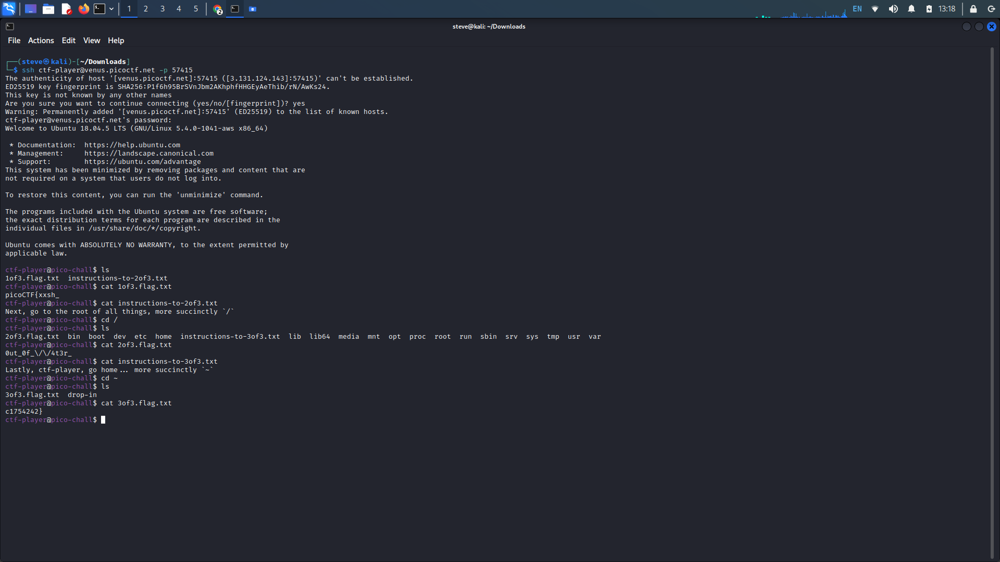
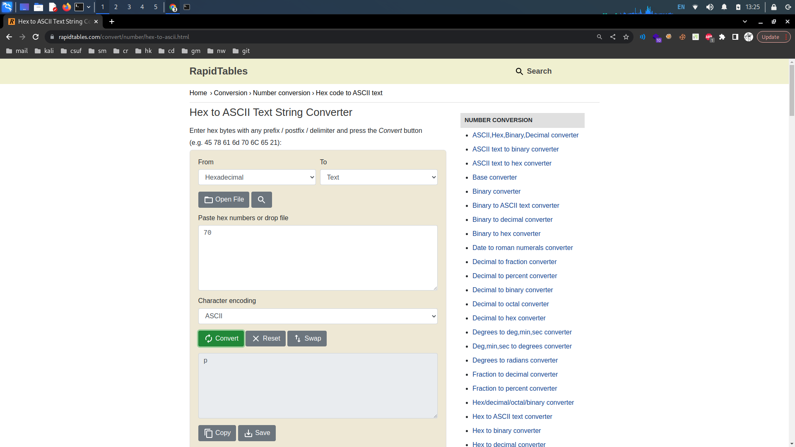
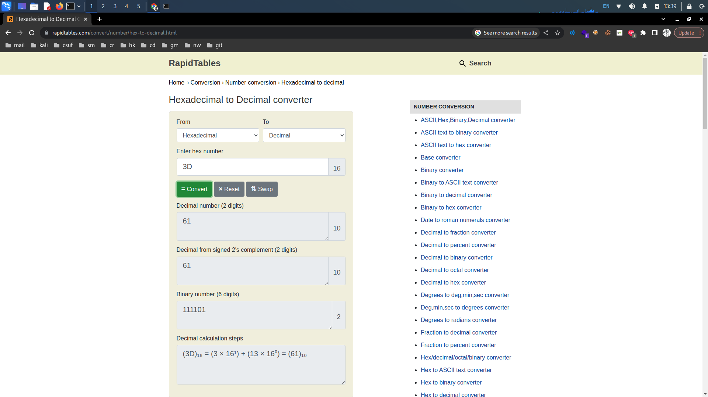

# PicoCTF General Skills: 6-10

## 6. Tab, Tab, Attack&#x20;

Provided Hints:

After `unzip`ing, this problem can be solved with 11 button-presses...(mostly Tab)...

**Description:** Using tabcomplete in the Terminal will add years to your life, esp. when dealing with long rambling directory structures and filenames: [Addadshashanammu.zip](https://mercury.picoctf.net/static/fe16c756149cfa85f23e73cd9dbd6a25/Addadshashanammu.zip)

After downloading the zip file, navigate to your downloads folder and unzip the file with the _unzip_ command followed by the filename. Upon unzipping the file, we can see the new directories that are within the unzipped directories. Listing the new files with _ls_ there is a new directory.&#x20;

Type _cd_ followed by the letters of the directory until you can press tab to auto-complete the name of the new directory. Keep pressing tab to navigate through the directories until you get to "Ularradallaku" directory.

In this directory we see an executable file when we list the files. Execute the file with _./_ followed by the filename.&#x20;

<figure><figcaption></figcaption></figure>

## 7. Magikarp Ground Mission

Provided Hints:

Finding a cheatsheet for bash would be really helpful!

**Description:**  Do you know how to move between directories and read files in the shell? Start the container, \`ssh\` to it, and then \`ls\` once connected to begin. Login via \`ssh\` as \`ctf-player\` with the password, \`b60940ca\`

Additional details will be available after launching your challenge instance.

First, launch the instance seen in the challenge window, then copy and paste the provided ssh command. This command will log you into the venus.picoctf machine with the username ctf-player through the given port. When the command is entered, you will be prompted for the password, which you are given in the description.

We see that the machine is a Linux machine, so it shouldn't be very difficult to navigate through. Concatenate the files with _cat_ and follow the instructions. The instructions will lead you to different directories to get all three parts of the flag.

<figure><figcaption></figcaption></figure>

## 8. Lets Warm Up

Provided Hints:

Submit your answer in our flag format. For example, if your answer was 'hello', you would submit 'picoCTF{hello}' as the flag.

**Description:** If I told you a word started with 0x70 in hexadecimal, what would it start with in ASCII?

This one is extremely simple, go to google and search up 0x70 in hexidecimal to ASCII or find any hexadecimal to ASCII converter. Type 70 in the hexidecimal field and convert it to ASCII. Type the converted ASCII character within the brackets of the flag format, picoCTF{x}.

<figure><figcaption></figcaption></figure>

## 9. Warmed Up

Provided Hints:

Submit your answer in our flag format. For example, if your answer was '22', you would submit 'picoCTF{22}' as the flag.

**Description:** What is 0x3D (base 16) in decimal (base 10)?

Similar to the last one, we can search up a base 16 (hexadecimal) to base 10 (decimal) converter to do this quickly.&#x20;

Base 16 otherwise known as hexadecimal has a base range of 16, ranging from 0-9 to A-F. While base 10, what we are most used to, range from 0-9.

Every number past 9 in hexadecimal is equivalent to the numbers past 9 in base 10, so A is equivalent to 10, B is equivalent to 11, so on.&#x20;

If we wish to do the conversion ourselves instead of looking it up, we must  multiply each digit with the powers of 16 starting from the units place of the number. In our case, 3 would be our 1st unit and D, which is equivalent to 13, would be our 0 unit.

Therefore, (3 x 16^1) + ( 13 x 16^0) = 16 x 3 + 13 = 61

<figure><figcaption></figcaption></figure>

## 10. 2Warm

Provided Hints:

Submit your answer in our competition's flag format. For example, if your answer was '11111', you would submit 'picoCTF{11111}' as the flag.

**Description:** Can you convert the number 42 (base 10) to binary (base 2)?

This time, we are converting from decimal to binary, the language of computers, ranging from 0-1. Again, we can use a decimal to binary converter online. But If we want to compute this ourselves...

Divide the decimal number, in this case 42 by 2 until we get to 0 as the quotient. While doing so, note the remainders.

42/2 = 21r**0**, 21/2 = 10r**1**, 10/2 = 5r**0**, 5/2 = 2r**1**, 2/2 = 1r**0**, 1/2 = 0r**1**

Next, write down the remainders in reverse to which we solved them. In this case, it should look like **101010**.

<figure><figcaption></figcaption></figure>
